# Emberwake — Story checkpoints

Where the game is up to, one screenshot per story checkpoint. Generated by
`tools/checkpoints.sh` from `data/scenarios.json` (at commit `be1030a`, 2026-10-10 09:29 UTC).

Play from any of them: `godot --path . -- --scenario=<id>`, or in a debug build open the
pause menu (Esc) → **Chapter select (dev)**. `--scenario=list` prints them all.
Screenshots come from the sandbox's Compatibility renderer and look paler than the game.

## Act I — The Wake

### Wake on Shingle Point  (`--scenario=new_game`)

A brand-new game: the waking narration, Pell, and the humming pebble on the beach.

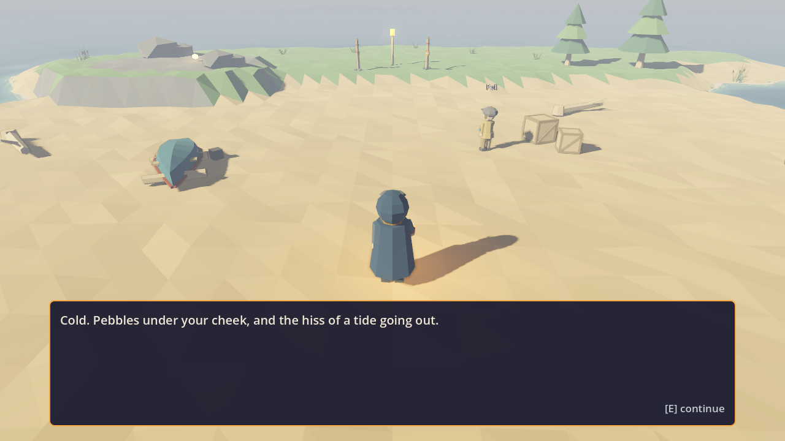

### Arrive in Saltmarrow  (`--scenario=saltmarrow`)

Pebble found and kept (Lost Things done). Meet Mara, Brother Aldous and Tam at the boardwalk gate.

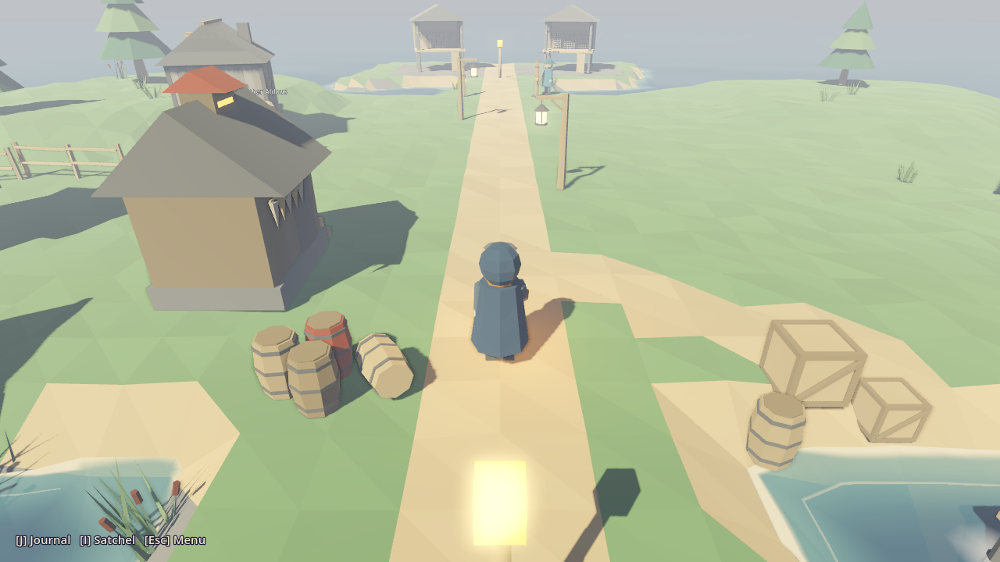

### Past the boardwalk gate  (`--scenario=gulls_head`)

Mara gave you her Harbormaster's Token and Aldous (treated gently) sent you to the beacon. Old Hesk, the greyed lofts, the Remembering Knot, and the dark headland deep in the Greying.

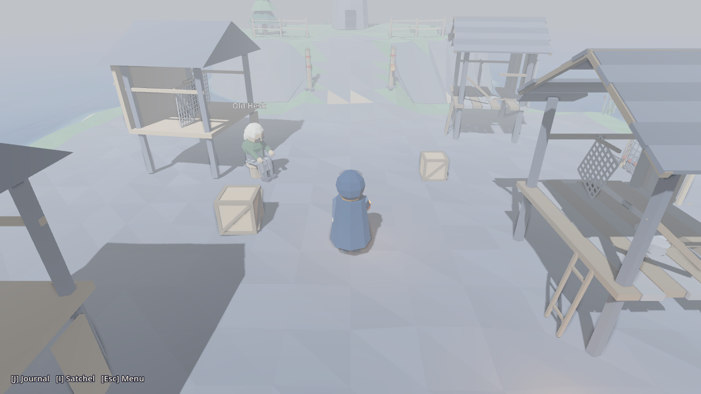

### The Burning  (`--scenario=the_burning`)

You carry the pebble and the knot, and Hesk's word about Dunstan. Walk up the ramp to the Gull's Beacon and choose what Saltmarrow forgets (or fetch Mara's whittled gull from her first).

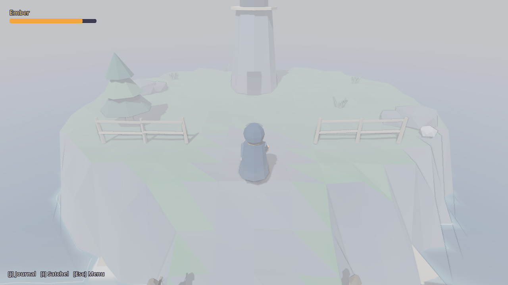

### After the burn: the lullaby  (`--scenario=aftermath_pebble`)

The Gull's Beacon burned the humming pebble. Saltmarrow after the burn: the light, the drying nets, Mara and Pell.

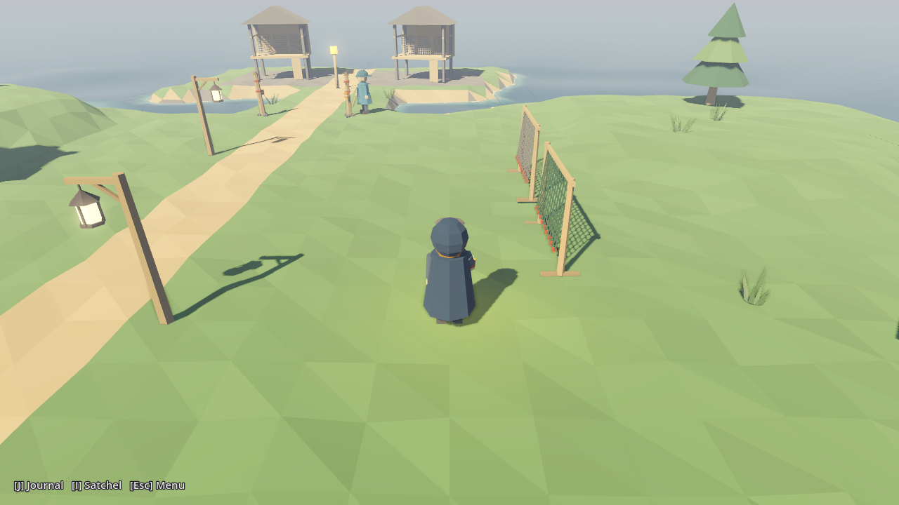

### After the burn: Mara's brother  (`--scenario=aftermath_gull`)

The beacon burned Mara's memory of Dunstan (the whittled gull). Two cups by the stool; nobody can say whose the dent is.

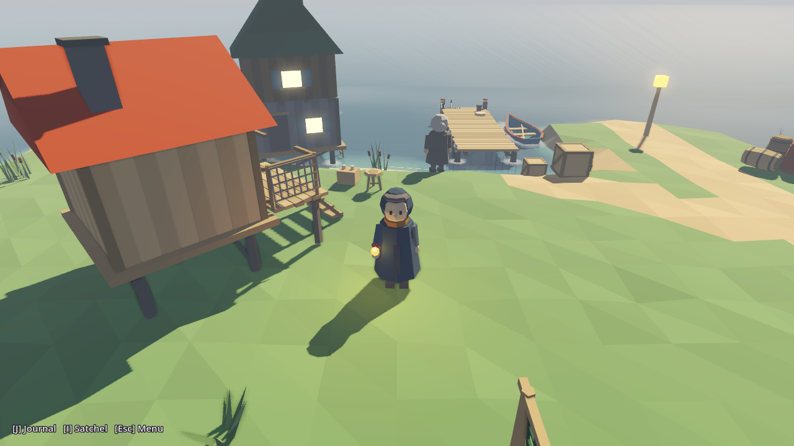

### After the burn: the founding knot  (`--scenario=aftermath_knot`)

The beacon burned the founding knot: nets begun in the middle, Hesk silent. Mara's aftermath scene is waiting, and Aldous is ready to tell the rest of his story.

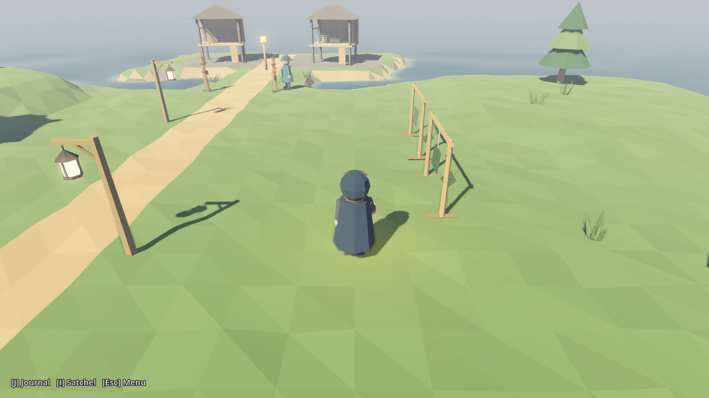

### The ferry's arrival  (`--scenario=ferry_arrived`)

Aldous confessed in full (you carry his sleeve-ember), Mara hung the green lantern and the Slow Mercy has put in. Talk to Oda Farrow at the dock end; Pell was promised a crossing.

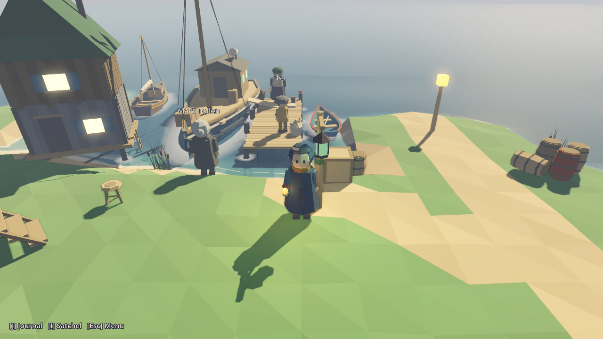

### The evening tide  (`--scenario=act_one_end`)

Deed weighed, Mara gave Pell leave, passage taken (Act I's end). Ask Oda to cast off for the crossing to Thornwold.

## Act II — The Drift

### Thornwold Landing  (`--scenario=thornwold`)

Just ashore after the crossing, with Pell along. Meet Bram Kettle at the lumber camp and look at the bramble wall across the cart road.

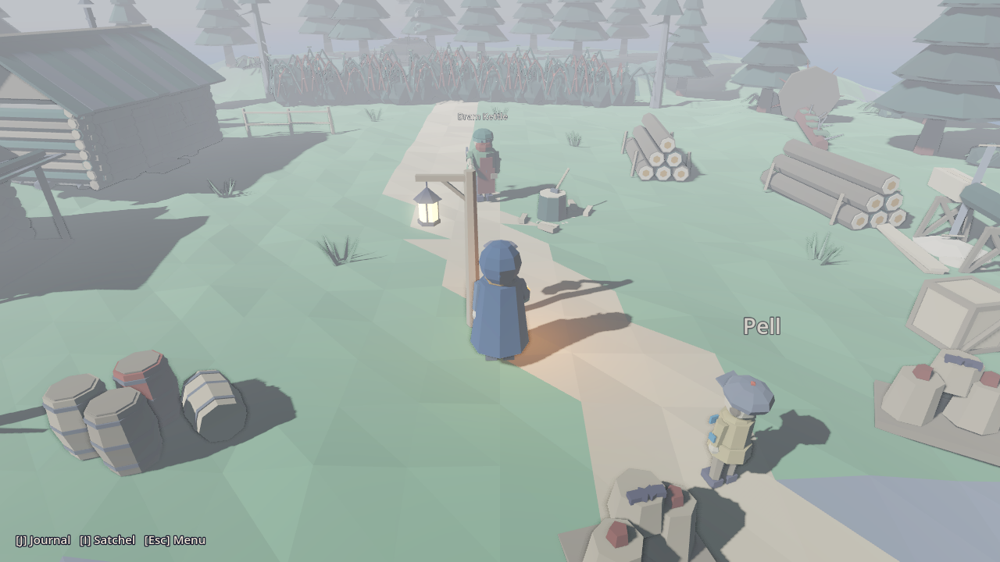

### Past the bramble wall  (`--scenario=thornwold_woods`)

Bram met; the ember parted the bramble wall. The straight road into the Greying, the waymark lanterns west to the colliers' clearing, Hob Marl and his clamp. Bram's salt not yet carried.

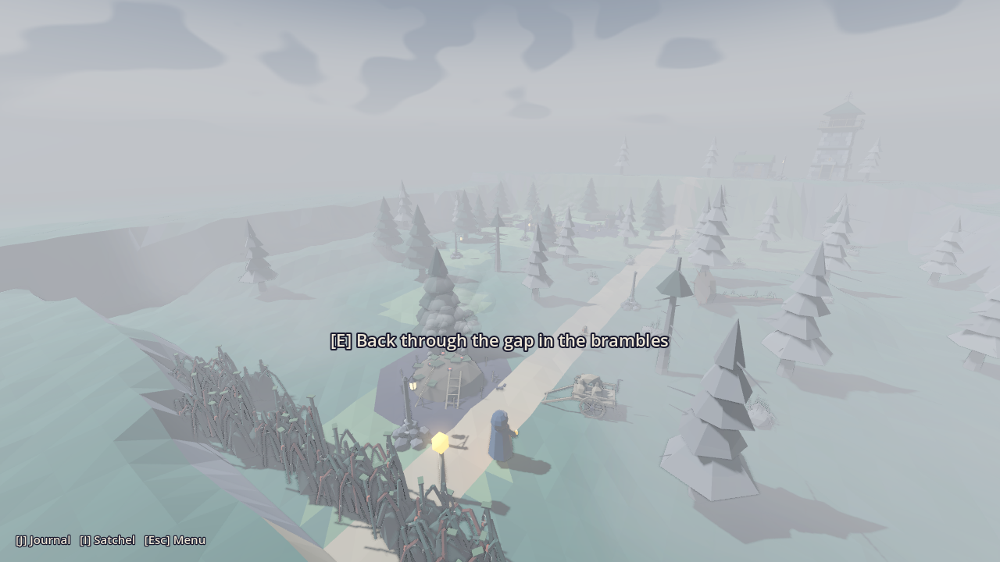

### The ridge and the Lamp  (`--scenario=thornwold_ridge`)

Hob met and paid; the Keepers' ladder stood and climbed. The ridge top in the Greying: the cold Ridge Light, the keeper's lodge, and the Lamp at the lantern bench. Ask about the iron box, the ladder, Aldous, and a lantern for the stair.

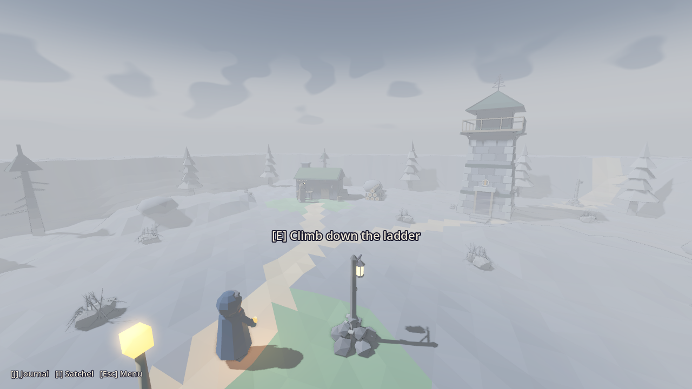

### The Ridge Light lit  (`--scenario=thornwold_lit`)

Thornwold's burning, the boots path: the Lamp met and asked; Hob gave Ottie's boots (his memory of the four colliers) and they burned in the Ridge Light. The tower gold, the fog leaning back. Go down to the woods and the camp: Hob comes in by daylight, Bram, Pell and Oda after the burn.

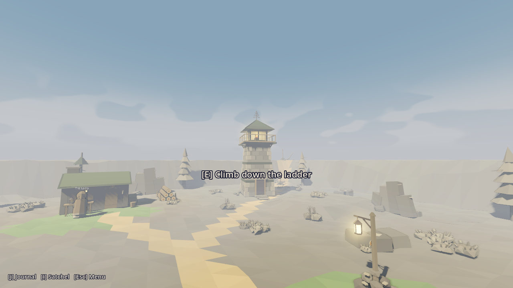

### Glasswater Fen  (`--scenario=glasswater_fen`)

Oda has sailed north-about from the lit Ridge Light to Glasswater Fen (boots path; Hob came in). Come ashore at the staithe: Hesper Vail of the Unmoored, Dunstan's rowboat, the letting post past the west walk, Corran Teal the eel-man, and the Heron Light dark out on the mere.

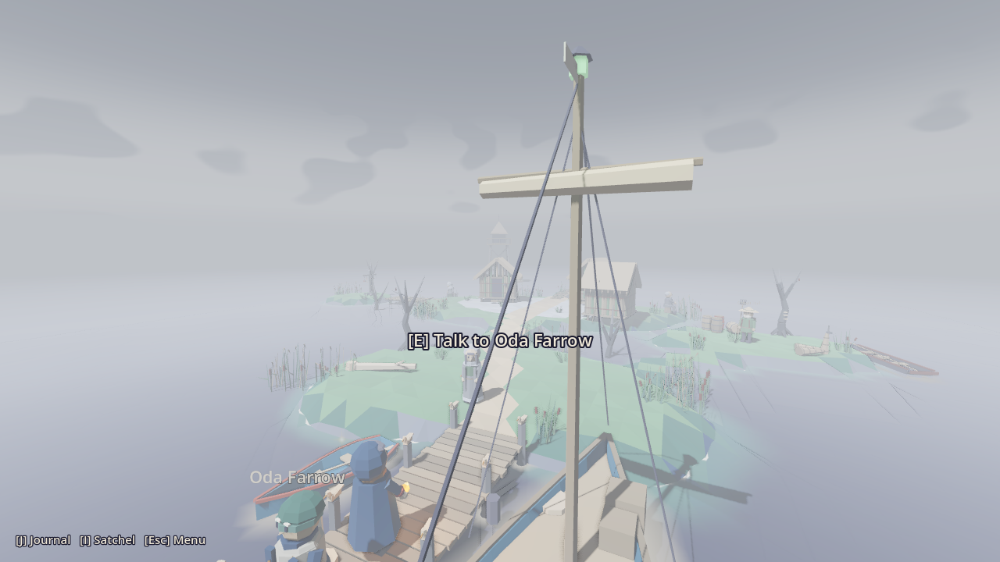

### Out to the Heron's legs  (`--scenario=heron_mere`)

Hesper met (the ember kept bare); Corran asked for his far trap, it lifted from the end of the long walk and brought back (in it, the keeper's skiff bell), and he has poled you out to the Heron Light. The Foot, the keeper's skiff (hang the bell or keep it), the scraped ladder, a big man at the fog's edge, Corran waiting by the punt.

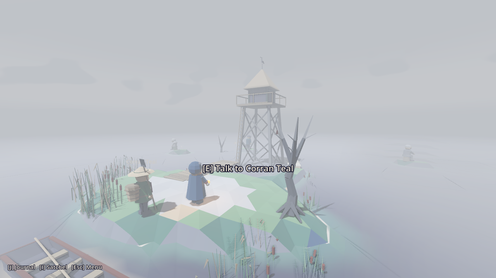
